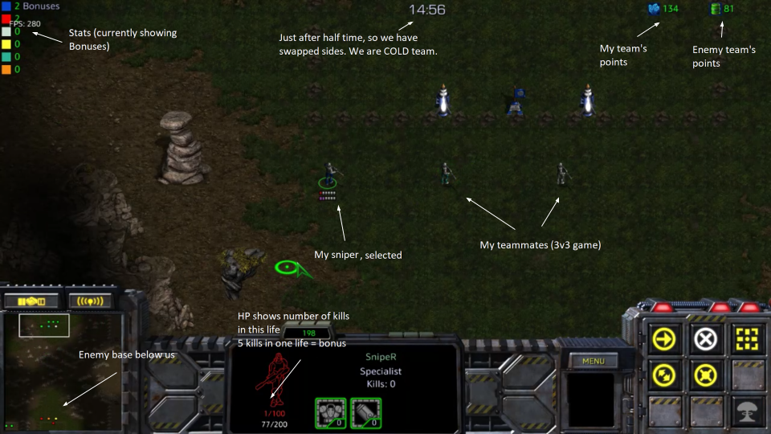

A game of snipers lasts 30 in-game minutes, which translates to ~21 real minutes. You control a single Terran Ghost, which respawns if it dies.

Snipers is a game of capture-the-flag. The objective of the game is to score more points than your opponents. Games are usually 2v2 or 3v3, with HOT team (hot colors) against COLD team (cold colors).

You can score points by either killing your opponents or capturing the enemy flag. A kill is worth 1 point, and a flag is worth 15.

Each team has a “base”, which is represented by a pair of turrets with a flag between them. The turrets give a team permanent sight of their base.

HOT team starts at the top of the map and COLD at the bottom, but the teams switch sides halfway through (at 15:00).

