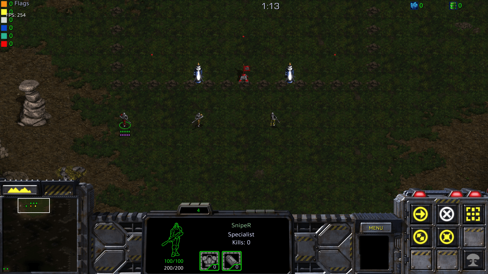
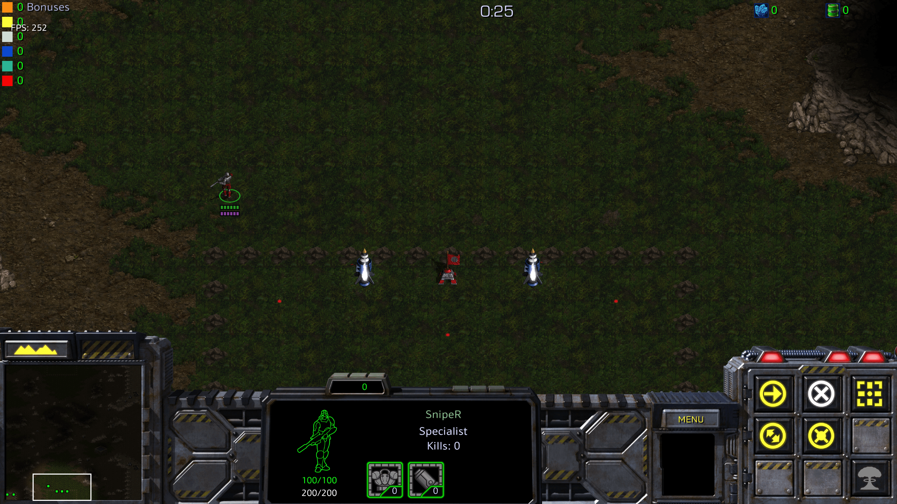

When you die, you respawn (RS) back at your base after 8 seconds. That's ~12 in-game seconds on the in-game timer.

There are three possible respawn locations in your base, all located behind the flag.

These are called the left, mid, and right RSes.

You will often have to react quickly after you respawn, for example to shoot an enemy coming in for your flag. The best thing to do is to make a selection box around the RS locations and hover there, waiting for your sniper to appear.

When your sniper respawns let go of your mouse button and quickly press A to bring up the attack cursor. Then, you’re ready to lock an enemy sniper or give your first move command to get your sniper going quickly.

If you can get a feel for how long the respawn cycle takes, you’ll be able to react faster to your sniper appearing.

<figure>
    `youtube: 2Xc9gXyf2G4`
    <figcaption>Example RS. After I die, I box around all three respawn locations and wait.</figcaption>
</figure>
